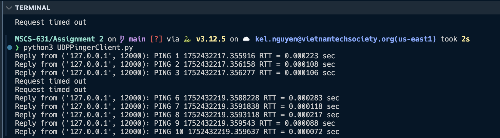

# Overview
This project implements a simple UDP-based ping client in Python. It is designed to interact with a corresponding UDP ping server to simulate the behavior of the standard ping utility, but using the User Datagram Protocol (UDP) instead of ICMP. The client sends a series of ping messages to the server and measures round-trip time (RTT) for each message.

The purpose of this project is to demonstrate key networking concepts such as:

- UDP socket communication

- Timeout handling

- Packet loss simulation

- RTT measurement

# Sample Output

