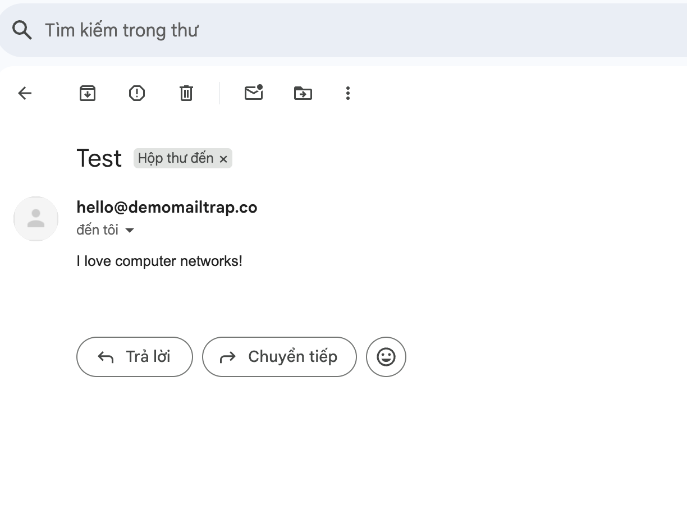

# Overview

This project implements a simple SMTP email client in Python using raw sockets. The client manually connects to a mail server and performs a basic SMTP handshake to send a text-based email message. Unlike high-level libraries like `smtplib`, this implementation demonstrates how SMTP operates at the protocol level by using direct socket communication and sending SMTP commands explicitly.

The purpose of this lab is to reinforce key networking concepts such as:

- SMTP command structure and client-server dialogue
- TCP socket programming
- Manual construction of email headers and message body
- Understanding server responses and status codes
- Exposure to common email delivery issues (e.g., authentication, domain matching)

This lab provides hands-on experience with Internet protocols and helps students understand how modern email systems operate securely and reliably.

# Sample Output

